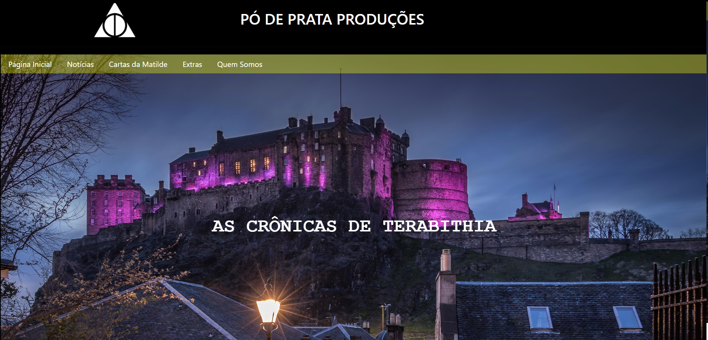

# Site - As Crônicas de Terabithia

## Objetivo
Este site foi elaborado para uma apresentação da matéria de Eletiva PHP, que realizei na Fatec de Mogi das Cruzes, no 2º semestre de 2023.
A minha ideia foi a de criar um site fictício de uma produtora de filmes, que estaria fazendo uma adaptação de um livro para filme, com o nome "As crônicas de Terabithia".
Clique [AQUI](https://nattansouza404.github.io/Site-As-Cronicas-De-Terabithia/) para acessar o site.

## Aprendizado
Esse projeto foi um ponto importante na minha trajetória como desenvolvedor. Pude colocar em prática o desenvolvimento da interface de um site, usando HTML, CSS e Bootstrap.
Mesmo que a aplicação tenha sido básica, consegui ter domínio sobre as ferramentas que fiz uso, aumentando minha confiança para projetos futuros.
Além disso, foi um projeto que pude colocar em prática o design e a criatividade, usando como inspirações obras que aprecio.

## Os requisitos para o site foram:
- Tema livre.
- Com 4 páginas no mínimo.
- Com um formulário.
- Com rodapé.
- Com menu.

## Inspirações para o site:
- A Ponte de Terabithia.
- As Crônicas de Nárnia.
- Harry Potter.
- O Senhor dos anéis.
- Alice no país das maravilhas.
